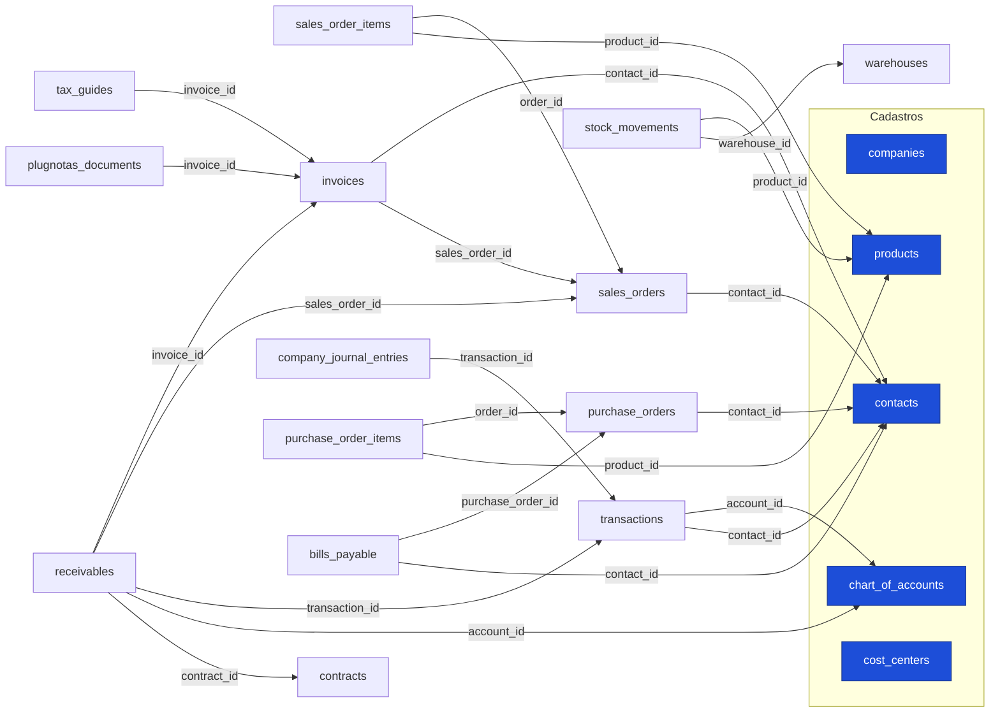

# Mapa de integração do ERP: as tabelas se conversam? (2026-08-11)

Auditoria do grafo real de chaves estrangeiras e dos gatilhos (triggers) do banco
`oxymhnddzamsjxwfglud`, para responder: **o fiscal (emissão de notas) concatena com o
resto do ERP (comercial, financeiro, estoque, contábil)?**

## Resposta curta

**Sim, e o desenho é coeso.** As tabelas compartilham um núcleo de cadastros e o caminho
crítico (pedido → nota → recebível → lançamento → contábil) está ligado por chaves
estrangeiras, com automação por trigger entre as áreas. Não há ilhas no fluxo principal.
Há três pontos onde o encadeamento é feito pelo aplicativo (não por trigger) e valem
atenção, listados no fim.

## O fluxo principal, ligado por chave estrangeira

## A nota fiscal está no centro, ligada nos dois sentidos

- **Para trás (de onde a nota vem):** `invoices.contact_id` → cliente; `invoices.sales_order_id`
  → pedido de venda. A nota que emitimos (via `nfse-proxy`) grava esses dois vínculos.
- **Para frente (o que aponta para a nota):** `receivables.invoice_id` (conta a receber),
  `tax_guides.invoice_id` (guia de imposto), `plugnotas_documents.invoice_id` (documento do provedor).

## Automação entre áreas (triggers — o dado flui sozinho)

| Gatilho | Em | Efeito |
|---|---|---|
| `trg_b_estoque_do_pedido` / `trg_a_transicao_pedido` | `sales_orders` (UPDATE) | Mudar o status do pedido **movimenta o estoque**. |
| `trg_auto_tax_guide_from_invoice` | `invoices` (INSERT/UPDATE) | Emitir a nota **gera a guia de imposto**. |
| `trg_auto_journal_pj` | `transactions` (INSERT/UPDATE/DELETE) | Cada lançamento **gera a partida contábil** (`company_journal_entries`). |
| `trg_bloquear_mes_fechado` | `transactions` | Bloqueia lançamento em **mês já fechado** (integridade do fechamento). |

## O catálogo (products) conversa com tudo

`products` é referenciado por `sales_order_items` (venda), `purchase_order_items` (compra),
`stock_movements` (estoque) e liga à contabilidade por `products.account_id` →
`chart_of_accounts`. Os campos fiscais que adicionamos (cTribNac, LC 116, NCM, CFOP,
cClassTrib, ISS) vivem no mesmo cadastro, então o mesmo item serve emissão de serviço
(NFS-e) e de produto (NF-e/NFC-e).

## Achados e o que foi implementado (2026-08-11)

1. **Nota → contas a receber agora é automático.** Trigger `trg_receivable_from_invoice`
   (`AFTER INSERT OR UPDATE OF status ON invoices`): ao autorizar a nota, abre o recebível ligado
   por `invoice_id`, de forma **idempotente** — não duplica se já existir, e **vincula** o recebível
   do pedido (quando a nota nasce de um `sales_order` que já tinha recebível). `source = 'nota_fiscal'`.
   Validado: nota de teste gerou 1 recebível ligado, e o re-disparo não duplicou.
2. **Itens da nota: tabela `invoice_items`** criada (FK para `invoices` e `products`, RLS espelhando
   `sales_order_items`). O `nfse-proxy` passou a gravar o item do serviço ao emitir. Fecha o rastreio
   produto/serviço ↔ nota de forma estruturada.
3. **Baixa de estoque × pedido: já estava resolvido por design.** O trigger de estoque grava
   `stock_movements.reference_type = 'sales_order'` e `reference_id = <pedido>` (referência
   polimórfica, o mesmo campo cobre pedido, cancelamento e ajuste). O rastreio da origem existe; uma
   FK formal quebraria o polimorfismo, então foi mantido como está.

## Conciliação bancária (fecha o ciclo do dinheiro)

O ciclo completo: **nota → recebível → (cliente paga) → extrato bancário → baixa do recebível**.

- Entrada do extrato: Open Finance / Pluggy / Inter / Asaas / Stripe geram `transactions`
  (`type='revenue'`). Gateways (Asaas/Stripe) já **dão baixa automática** no recebível por webhook
  (ligam `receivables.transaction_id` e marcam `recebido`).
- Conciliação (`reconcile-transactions`): casa o crédito do extrato com o lançamento já existente
  (anti-duplicidade), e agora também **fecha o recebível em aberto**:
  - `suggest_receivables`: para créditos do extrato ainda não conciliados, sugere o recebível
    `a_receber`/`vencido` que casa por valor (±5%), janela de data (até 15 dias após o vencimento) e
    contato.
  - `settle_receivable`: dá baixa no recebível usando o **crédito real do extrato** como a receita
    (liga `transaction_id`, marca `recebido` + `payment_date`, e concilia a transação). Idempotente.
- Isso resolve o caso do pagamento por PIX/transferência (via Open Finance), em que o dinheiro cai
  no banco antes da baixa manual: o recebível deixa de ficar preso em `a_receber`.

## Lado das compras (espelho): notas de entrada → contas a pagar → baixa

O mesmo ciclo, na direção da saída de dinheiro (ver `PIPELINE-COMPRAS-ENTRADA.md`):

- **Notas destinadas** (emitidas contra o CNPJ) entram via `inbound_documents`, baixadas da Focus
  (`sync_nfe`, distribuição DF-e) e transformadas em `bills_payable` (`to_bill`).
- Conciliação (`reconcile-transactions`): `suggest_payables` casa o **débito** do extrato com a
  conta a pagar em aberto; `settle_payable` dá baixa (`pago` + `payment_date`, concilia a transação).
- Fecha `fornecedor → nota destinada → conta a pagar → extrato(débito) → baixa`.

## Conclusão

O medo de "tabelas que não se conversam" não se confirma: o núcleo é compartilhado, a nota fiscal
está encadeada com cliente, pedido, recebível, itens, guia e provedor, e o ciclo do dinheiro fecha
(nota → recebível → extrato → baixa). Achados fechados: nota gera recebível (trigger), nota tem
itens (tabela), origem do pedido na baixa de estoque já era rastreada, e a conciliação agora liga o
crédito do extrato ao recebível em aberto.
