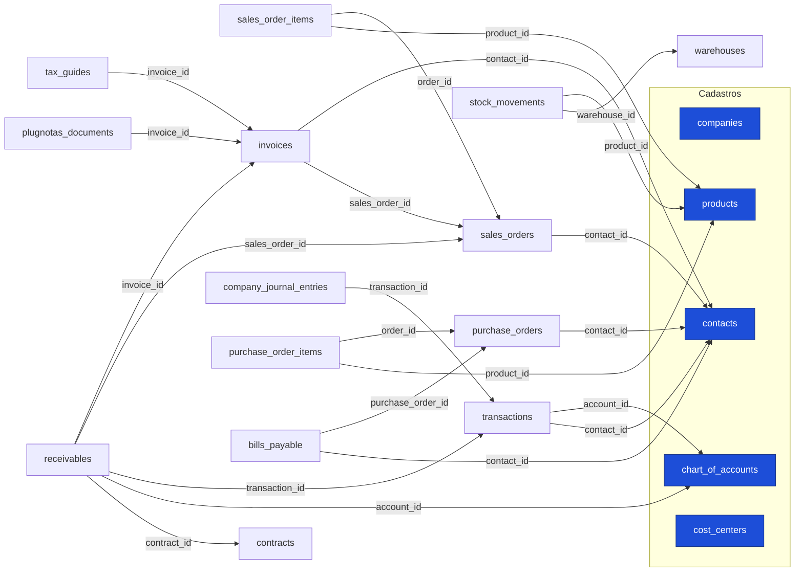

# Mapa de integração do ERP: as tabelas se conversam? (2026-08-11)

Auditoria do grafo real de chaves estrangeiras e dos gatilhos (triggers) do banco
`oxymhnddzamsjxwfglud`, para responder: **o fiscal (emissão de notas) concatena com o
resto do ERP (comercial, financeiro, estoque, contábil)?**

## Resposta curta

**Sim, e o desenho é coeso.** As tabelas compartilham um núcleo de cadastros e o caminho
crítico (pedido → nota → recebível → lançamento → contábil) está ligado por chaves
estrangeiras, com automação por trigger entre as áreas. Não há ilhas no fluxo principal.
Há três pontos onde o encadeamento é feito pelo aplicativo (não por trigger) e valem
atenção, listados no fim.

## O fluxo principal, ligado por chave estrangeira

## A nota fiscal está no centro, ligada nos dois sentidos

- **Para trás (de onde a nota vem):** `invoices.contact_id` → cliente; `invoices.sales_order_id`
  → pedido de venda. A nota que emitimos (via `nfse-proxy`) grava esses dois vínculos.
- **Para frente (o que aponta para a nota):** `receivables.invoice_id` (conta a receber),
  `tax_guides.invoice_id` (guia de imposto), `plugnotas_documents.invoice_id` (documento do provedor).

## Automação entre áreas (triggers — o dado flui sozinho)

| Gatilho | Em | Efeito |
|---|---|---|
| `trg_b_estoque_do_pedido` / `trg_a_transicao_pedido` | `sales_orders` (UPDATE) | Mudar o status do pedido **movimenta o estoque**. |
| `trg_auto_tax_guide_from_invoice` | `invoices` (INSERT/UPDATE) | Emitir a nota **gera a guia de imposto**. |
| `trg_auto_journal_pj` | `transactions` (INSERT/UPDATE/DELETE) | Cada lançamento **gera a partida contábil** (`company_journal_entries`). |
| `trg_bloquear_mes_fechado` | `transactions` | Bloqueia lançamento em **mês já fechado** (integridade do fechamento). |

## O catálogo (products) conversa com tudo

`products` é referenciado por `sales_order_items` (venda), `purchase_order_items` (compra),
`stock_movements` (estoque) e liga à contabilidade por `products.account_id` →
`chart_of_accounts`. Os campos fiscais que adicionamos (cTribNac, LC 116, NCM, CFOP,
cClassTrib, ISS) vivem no mesmo cadastro, então o mesmo item serve emissão de serviço
(NFS-e) e de produto (NF-e/NFC-e).

## Pontos de atenção (encadeados pelo app, não por trigger)

1. **Nota → contas a receber não é automático.** A estrutura existe (`receivables.invoice_id`,
   `sales_order_id`, `transaction_id`), mas não há trigger que crie o recebível ao emitir a nota;
   hoje o `nfse-proxy` grava a `invoice` e a guia (via trigger), porém **não cria/vincula o
   recebível**. Decisão a alinhar: a NFS-e emitida deve abrir a conta a receber, ou o recebível
   nasce do pedido/contrato? Recomendação: gerar o recebível ligado à nota (idempotente por
   `invoice_id`) para não duplicar quando já houver um do pedido.
2. **Nota sem tabela de itens.** Não existe `invoice_items` ligando a nota aos produtos; o rastreio
   produto↔nota é indireto (via `sales_order_id` → `sales_order_items`). Para NFS-e (um serviço) é
   suficiente; para NF-e multi-item, considerar itens estruturados no futuro.
3. **Baixa de estoque sem FK ao pedido.** `stock_movements` liga a `products`/`warehouses`, e a
   baixa é disparada pelo trigger do pedido, mas não guarda `sales_order_id` como chave. Rastreio da
   origem da movimentação fica pelo histórico, não por FK.

## Conclusão

O medo de "tabelas que não se conversam" não se confirma no caminho crítico: o núcleo é
compartilhado, a nota fiscal está encadeada com cliente, pedido, recebível, guia e provedor, e há
automação real entre comercial, fiscal, financeiro e contábil. Os três pontos acima são
oportunidades de reforço (principalmente o nº 1, nota → recebível), não rupturas.
